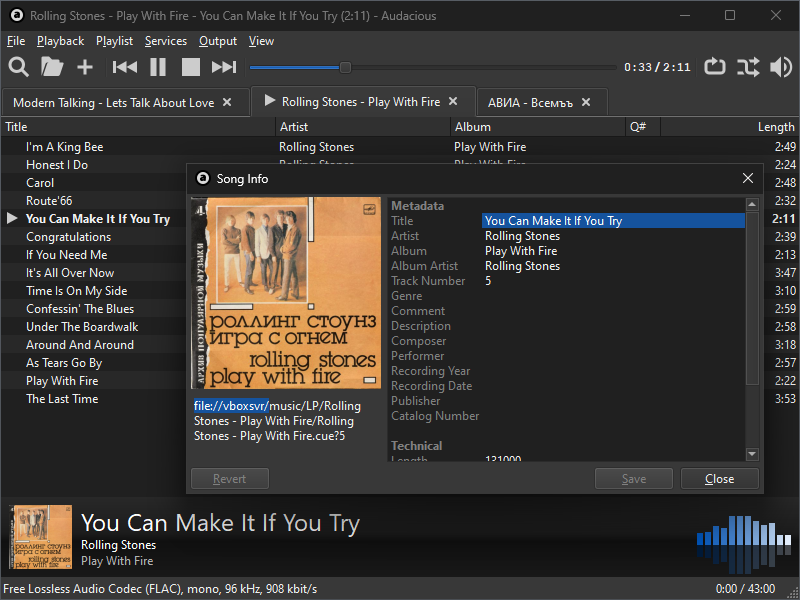
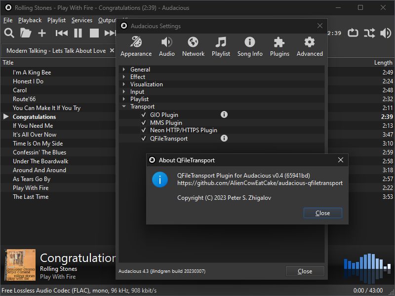

# QFileTransport Plugin for Audacious

## Description

This is a transport plugin for the [Audacious audio player](https://audacious-media-player.org/). This plugin uses the Qt file I/O subsystem for local files, which supports more edge cases. For example, with this plugin you can play audio files with paths like `file://hostname/share/path/to/file.mp3` on Windows from your SMB server.

The implementation of Audacious's VFS does not allow override the transport for local files (see [libaudcore/vfs.cc](https://github.com/audacious-media-player/audacious/blob/audacious-4.4/src/libaudcore/vfs.cc#L45-L46) for details). Also the implementation of Audacious's scanner for cover images uses GLib internally (see [libaudcore/art-search.cc](https://github.com/audacious-media-player/audacious/blob/audacious-4.4/src/libaudcore/art-search.cc#L61-L131) for details). For this reasons, the plugin is not cross-platform and uses platform-specific hooks, which are implemented only for x86 and x86_64 Windows builds at this moment.

## Installation

1. Download the `qfiletransport.dll` file from the [Releases page](https://github.com/AlienCowEatCake/audacious-qfiletransport/releases/)
2. Place downloaded `qfiletransport.dll` file to the Transport plugins directory of your Audacious installation (something like `C:\Program Files (x86)\Audacious\lib\audacious\Transport\`)
3. Launch Audacious

## Screenshots

